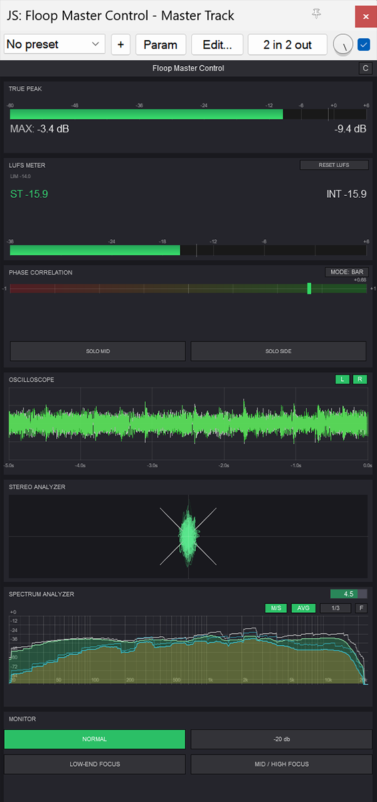
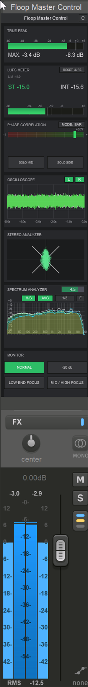
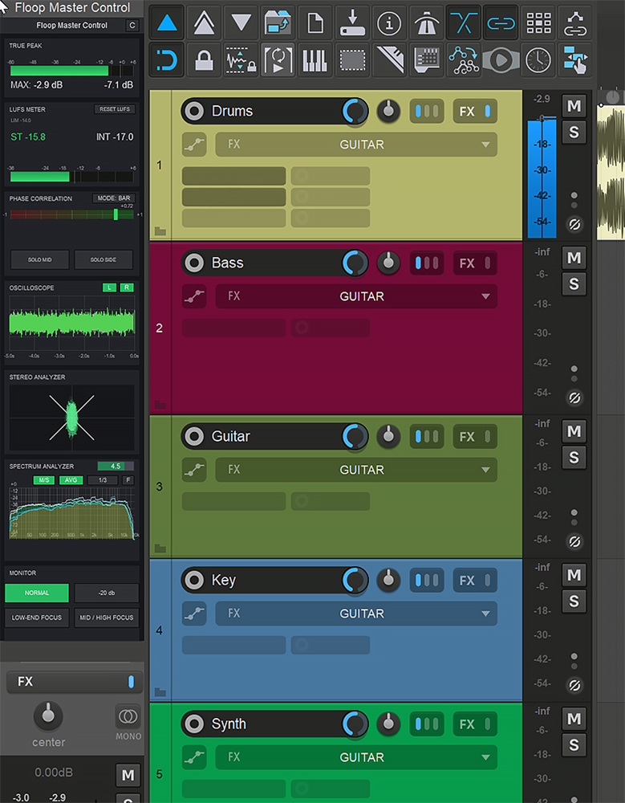

# Floop Master Control

**Integrated master monitoring and analysis for REAPER.**

## Overview

**Floop Master Control** is a comprehensive mastering and monitoring suite written in JSFX for REAPER. It provides essential visual feedback for audio analysis, combining multiple metering tools into a single, efficient interface.
It includes True Peak limiting/metering, LUFS metering, Spectrum Analysis, and Phase correlation view.

## Screenshots

 
   
  
   

  
📸 Click to view more screenshots

  

  &nbsp;&nbsp;&nbsp;&nbsp;&nbsp;&nbsp; 
  

## Key Features

*   **Spectrum Analyzer**: High-resolution (4096-point FFT) frequency analysis.
*   **LUFS Metering**: ITU-R BS.1770-4 compliant Short-Term and Integrated loudness with history graph.
*   **True Peak Limiting/Metering**: Inter-sample peak detection.
*   **Stereo Field Analysis**: Phase Correlation meter and Goniometer.
*   **Oscilloscope**: Real-time waveform visualization.
*   **Monitor Control**: Dim (-20dB), Mono check, and Side monitoring.
*   **Low/Mid/High Focus**: Solo bass (~120Hz LP) or mid/highs for checking balance.
*   **Adaptive Embedded UI**: Smart scaling for REAPER's MCP (Mixer Control Panel), optimized for both laptop (15") and 4K screens.

## Requirements

*   **REAPER v7.00** or later.
*   Compatible with other DAWs via **YSFX** (VST/AU wrapper for JSFX).

### Method 1: ReaPack (Recommended)

1.  **Add the Repository to ReaPack**:
    *   Open **Extensions > ReaPack > Import Repositories...**
    *   Copy and paste this URL:
        https://github.com/floop-s/floops-reaper-scripts/raw/main/index.xml
    *   Click **OK**.

3.  **Install the Script**:
    *   Open **Extensions > ReaPack > Browse Packages**.
    *   Search for `Floop Master Control`.
    *   Right-click > **Install**.
    *   Click **Apply**.

### Method 2: Manual Installation

1.  **Open REAPER**.
2.  Go to **Options > Show REAPER resource path...**.
3.  Enter the **Effects** folder.
4.  Copy the `Floop Master Control.jsfx` file into this folder (or a subfolder like `Floop`).
5.  **Restart REAPER** (recommended) or press "F5" in the FX Browser.
6.  In the FX Browser, search for "Floop Master Control" and load it on your Master Track.

## Usage

### Interface Controls

*   **Config ("C" Button)**: Opens configuration sliders (Monitor Gain, TP Limit, LUFS Target, Spectrum settings).
*   **Spectrum Analyzer**:
    *   **FREEZE**: Pauses display.
    *   **Hover**: Shows Hz and dB.
    *   **Click**: Resets peak hold.
*   **Oscilloscope**:
    *   **L / R**: Toggle channel visibility.
    *   **Mouse Wheel**: Zoom time scale.
*   **Monitor Panel**:
    *   **NORMAL**: Standard stereo.
    *   **SOLO MID/SIDE**: Listen to Mono or Stereo info.
    *   **-20 dB**: Dim output.
    *   **LOW-END ONLY**: Solo <120Hz.
    *   **MID / HIGH FOCUS**: Solo >120Hz.
*   **LUFS Meter**:
    *   **RESET**: Clears loudness data.

### Embedding in Mixer (MCP)

To see the meters directly in the mixer without opening the window:
1.  Add the plugin to a track.
2.  Right-click "Floop Master Control" in the FX Chain.
3.  Select **Embed UI in MCP**.

## Troubleshooting

*   **High CPU**: The script is optimized, but high FFT sizes can be demanding. Reduce spectrum resolution if needed via sliders.

## Changelog

### v1.1.0
*   **Core UI Refactoring**: Rewrote rendering engine for native scalability across 4K monitors and laptops (tested on 27" and 15").
*   **Adaptive MPC Layout**: Dynamic optimization of Embedded (MPC) mode. Automatically hides non-critical elements (Oscilloscope) on small screens to prevent overlaps.
*   **Smart Scaling Logic**: Implemented adaptive threshold system (0.55) to ensure consistent readability of True Peak and LUFS parameters regardless of resolution.
*   **UI Cleanup**: Removed redundant manual controls (font sliders) in favor of a smoother, professional auto-scaling system.

### v1.0.0
*   Initial release with comprehensive metering suite.

## Credits
Inspired by A. Lunedì's master workflow

## Author

Developed by **Flora Tarantino**  
Project home: [https://www.floratarantino.com/floop-reaper-scripts/](https://www.floratarantino.com/floop-reaper-scripts/)

## License

Licensed under the **GNU General Public License v3.0 (GPL-3.0)**  
See the `LICENSE.txt` file in the main repository for details.