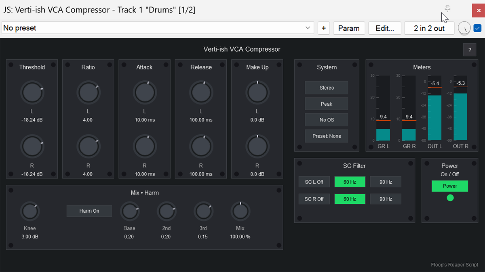

# Verti-ish VCA Compressor

**VCA-style compressor with "Verti-ish" character.**

## Overview

**Verti-ish VCA Compressor** is a JSFX effect for REAPER that emulates the behavior of classic VCA compressors with added modern flexibility.
It is perfect for mix bus glue, mastering applications, and punchy drum processing.
The plugin features independent Left/Right controls for detailed stereo image shaping, along with harmonic saturation and oversampling options.

## Screenshot

 
   
  
   

## Key Features

*   **VCA Character**: Snappy and gluey compression characteristics.
*   **Dual Mono / Stereo Modes**: Process channels independently or linked.
*   **Independent L/R Controls**: Separate Threshold, Ratio, Attack, Release, and Makeup for Left and Right channels.
*   **Harmonic Saturation**: Adds analog-style warmth with adjustable 2nd and 3rd harmonics.
*   **Sidechain Filters**: Built-in HPF (Off, 60Hz, 90Hz) to prevent low-end pumping.
*   **Oversampling**: High-quality processing modes (2x Relaxed, 2x Steep, 4x Ultra).
*   **Detector Modes**: Peak or RMS detection.
*   **Parallel Compression**: Built-in Mix knob.

## Requirements

*   **REAPER v7.00** or later.

## Installation

1.  **Open REAPER**.
2.  Go to **Options > Show REAPER resource path...**.
3.  Enter the **Effects** folder.
4.  Copy the `Verti-ish_VCA_Compressor.jsfx` file into this folder.
5.  **Restart REAPER** or press "F5" in the FX Browser.
6.  Load "Verti-ish VCA Compressor" from the FX Browser.

## Usage

### Controls

*   **Threshold L/R**: Set the compression starting point.
*   **Ratio L/R**: Compression intensity (1:1 to 20:1).
*   **Attack/Release L/R**: Envelope timing.
*   **Makeup L/R**: Output gain compensation.
*   **Knee**: Softness of the compression onset.
*   **Mode**: Switch between Stereo (Linked) and Dual Mono (Unlinked).
*   **SC Filter**: High-pass filter for the detector signal.
*   **Harmonics**: Enable and adjust saturation character.
*   **Quality**: Select oversampling level for alias-free operation.

## Changelog

### v1.0.0
*   Initial release.

## Author

Developed by **Flora Tarantino**  
Project home: [https://www.floratarantino.com/floop-reaper-scripts/](https://www.floratarantino.com/floop-reaper-scripts/)

## License

This project is licensed under the **GNU General Public License v3.0 (GPL-3.0)**.
