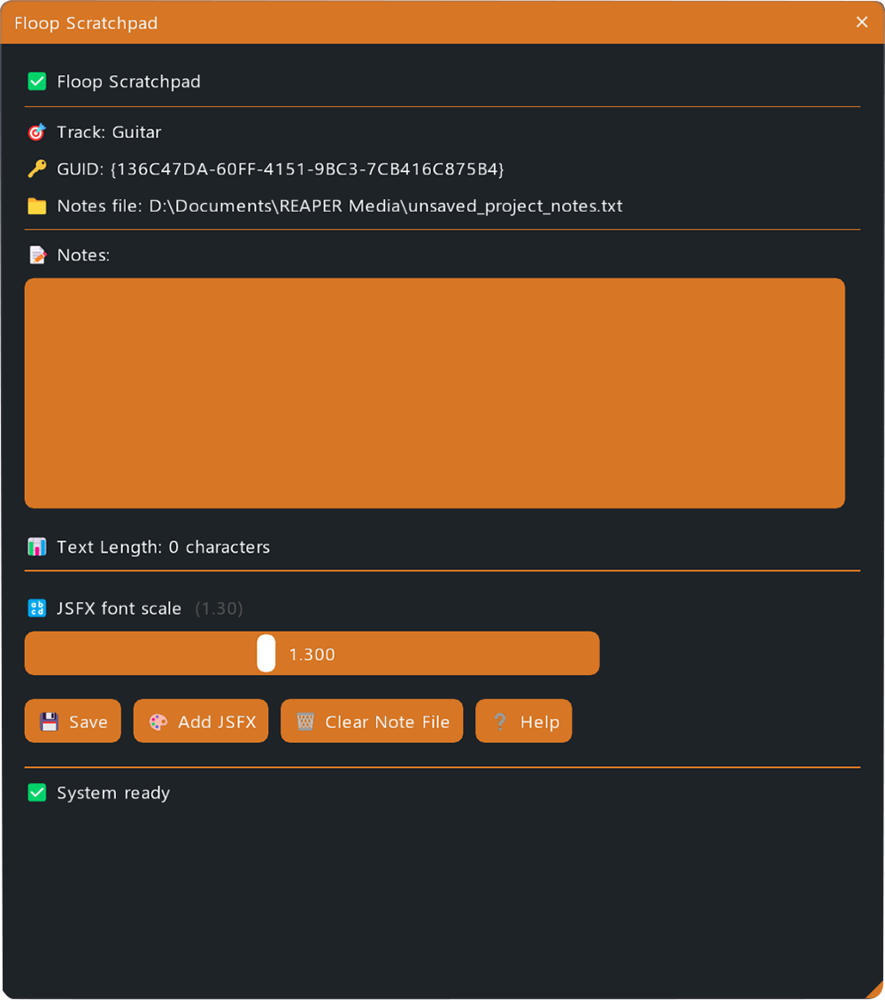
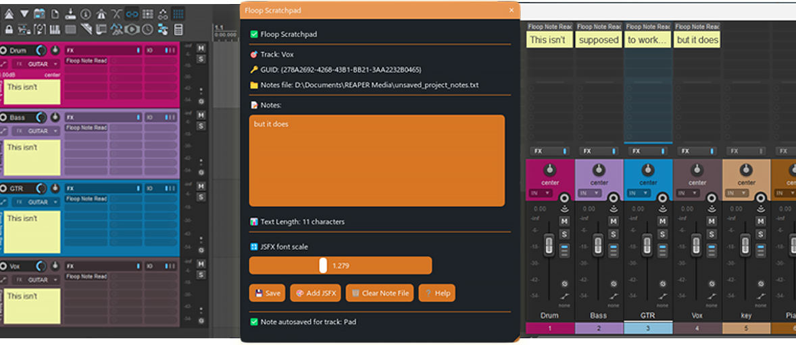

# Floop Scratchpad

**Track Notes System for REAPER.**

## Overview

**Floop Scratchpad** is a REAPER script that lets you write, view, and manage notes per track directly in your DAW.
Notes are automatically saved and recalled when switching tracks, keeping project annotations organized and accessible.
The script generates a companion JSFX (FloopNoteReader) that displays your notes in the Track/Mixer panels when embedding is enabled.

## Screenshots

 
    
   
    
     
   
    

## Key Features

*   **Per-Track Notes**: Write and store notes tied to each track.
*   **Auto-Load**: Notes load automatically when switching selected tracks.
*   **JSFX Note Reader**: Dynamically generates **FloopNoteReader.jsfx** to display notes in TCP/MCP.
*   **Autosave**: Avoids losing edits when switching tracks.
*   **Duplicate-Safe**: Prevents multiple JSFX instances on the same track.
*   **Compact UI**: Rounded sliders, white grab, flicker-free font scaling.
*   **Backup**: Creates a `.bak` file when clearing notes.
*   **Cross-Platform**: Windows, Mac, Linux.

## Requirements

*   **REAPER v7.5x** or later.
*   **ReaImGui**: "ReaScript binding for Dear ImGui" installed via ReaPack. **Minimum version required: 0.10.2+**.
*   **SWS/S&M Extension**: Required for automatic project startup refresh.

## Compatibility

*   **REAPER**: Developed and tested on **v7.5x+** (Windows).
*   **Operating Systems**:
    *   **Windows**: Fully tested and supported.
    *   **macOS / Linux**: Designed with cross-platform compatibility in mind (using system-agnostic path handling), but not personally tested on these systems. Feedback is welcome!

## Installation

The easiest way to install and keep the script updated is via **ReaPack**.

### Method 1: ReaPack (Recommended)

1.  **Install Prerequisites**:
    *   Open **Extensions > ReaPack > Browse Packages**.
    *   Search for and install:
        *   `ReaScript binding for Dear ImGui`
        *   `SWS/S&M Extension`
    *   **Restart REAPER**.

2.  **Add the Repository**:
    *   Open **Extensions > ReaPack > Import Repositories...**
    *   Copy and paste this URL:
        https://github.com/floop-s/floops-reaper-scripts/raw/main/index.xml
    *   Click **OK**.

3.  **Install the Script**:
    *   Open **Extensions > ReaPack > Browse Packages**.
    *   Search for `Floop Scratchpad`.
    *   Right-click > **Install**.
    *   Click **Apply**.

### Method 2: Manual Installation

1.  **Install Prerequisites**:
    *   Follow step 1 from the ReaPack method above to install `ReaImGui` and `SWS`.

2.  **Install the Script**:
    *   Download the script files.
    *   Copy `Floop Scratchpad.lua` and `Floop Startup Refresh.lua` to your REAPER Scripts folder (usually `AppData\Roaming\REAPER\Scripts` on Windows).

3.  **Load the Action**:
    *   Open the Actions List (`?` shortcut).
    *   Click **New Action > Load ReaScript...**
    *   Select `Floop Scratchpad.lua`.

## Usage

1.  **Launch** "Floop Scratchpad" from the Actions List.
2.  **Select a track**: Its name and GUID appear in the interface.
3.  **Type notes** and click "Save".
4.  **Switch tracks** to see notes update automatically.

### Embedding Notes in TCP / MCP

   *   Click "Add JSFX".
   *   In FX Browser, find `FloopNoteReader`.
   *   Right-click > "Default settings for new instance" > Enable "Show embedded UI in TCP or MCP".
   *   Future instances will auto-embed.

## Troubleshooting

*   **Embed not showing**: Ensure "Show embedded UI" is checked in the default settings for `FloopNoteReader`.
*   **Notes not loading**: Check if `SWS/S&M` is installed properly.

## Changelog

### v1.2.3 (2026-01-08)
*   **Fixed**: Critical issue where notes were lost when saving a previously unsaved project (implemented proactive in-memory migration).
*   **Fixed**: JSFX reader disappearing when adjusting font scale on tracks with empty notes.
*   **Fixed**: Race condition when switching project tabs.
*   **Improved**: Added numeric value display next to the Font Scale slider.
*   **Internal**: Improved project path detection using project pointers.

### v1.2.2 (2026-01-06)
*   **Fixed**: Linux compatibility issue (`attempt to concatenate a nil value`) by replacing Windows-specific environment variables with cross-platform path helpers.
*   **Fixed**: Function scope error in `Floop Startup Refresh.lua` that could cause runtime failures.
*   **Fixed**: Issue where notes disappeared when adjusting font scale slider (added auto-save and error checking before refresh).
*   **Fixed**: Note migration logic (removed filter) to ensure all notes are preserved when saving a temporary project.
*   **Improved**: Path handling and directory separators for all operating systems (Windows, macOS, Linux).

### v1.2.1 (2025-12-29)
*   **Added**: Mac/Linux support via `getSystemHome()` to resolve user home directory.
*   **Improved**: Path construction now uses `joinPath` for cross-platform compatibility.
*   **Updated**: `Floop Startup Refresh.lua` aligned with path and OS compatibility fixes.

### v1.1.0 (2025-10-23)
*   **Added**: SWS/S&M Project Startup Action integrating `Floop Startup Refresh.lua` to refresh JSFX on project open.
*   **Added**: Per-track font size persistence (`FontScale:` saved per GUID) and restored on load.
*   **Changed**: Autosave on track change now persists font size alongside notes.
*   **Fixed**: Startup refresh regenerates JSFX only for tracks with non-empty notes, using saved font scale.
*   **Note**: Requirements updated — SWS/S&M needed for automatic project startup refresh.

### v1.0.1 (2025-10-16)
*   **Fixed**: Clear Note File re-added JSFX on all tracks; refresh now re-adds only on tracks with non-empty notes.
*   **Changed**: Saving an empty note removes the JSFX; saving non-empty notes re-adds/updates the JSFX.

### v1.0.0 (2025-10-14)
*   Initial release.
*   **Added**: Auto-generated JSFX Note Reader per track.
*   **Added**: Prevention of duplicate JSFX instances on the same track.
*   **Fixed**: Slider flicker removed by refreshing after edit ends.

## Author

Developed by **Flora Tarantino**  
Project home: https://www.floratarantino.com

## License

Licensed under the **GNU General Public License v3.0 (GPL-3.0)**  
See the `LICENSE.txt` file in the main repository for details.
