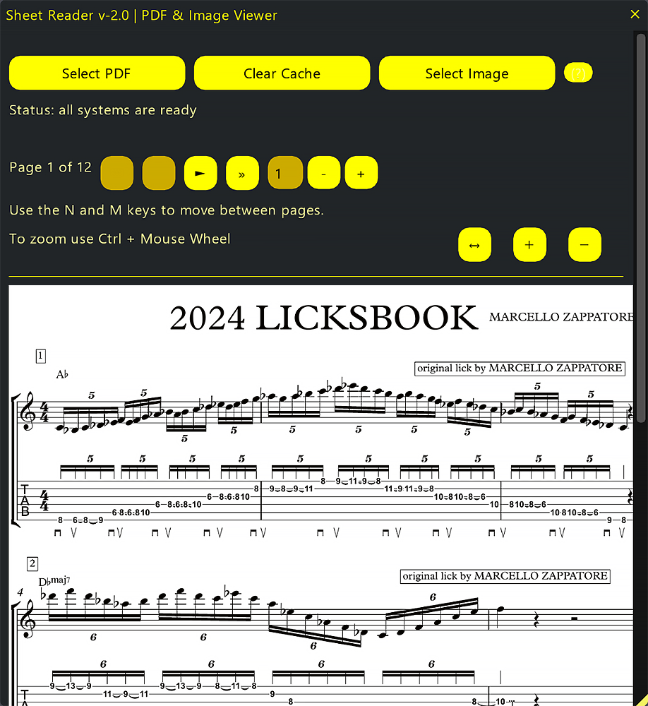

# Sheet Reader v2.1.0 - PDF & Image Viewer

**Sheet Reader** is a Reaper script that allows you to load and view PDF and image files directly inside Reaper. The script utilizes Poppler to convert PDF files into images for display in the GUI. Users can zoom in and out using the buttons or "Ctrl + Mouse Wheel".

## ⚠️ WINDOWS ONLY

**This script is developed exclusively for Windows.**
It relies on PowerShell and Windows Script Host for dependency management and process handling. It will **not** function on macOS or Linux.

## Screenshot

 
    
   
    

## Key Features

- **Load and view PDF files**: Automatic conversion of PDF pages into images using Poppler.
- **Load and view image files**: Supports PNG, JPG, JPEG.
- **Zoom functionality**: Buttons or "Ctrl + Mouse Wheel".
- **Navigation**: Next/Previous page buttons and keyboard shortcuts (M/N).
- **Direct Page Access**: Type the page number you want to view.
- **Cache Management**: Efficient caching of converted PDF pages.

## Requirements

- **REAPER** 7.5x or later
- **ReaImGui**: "ReaScript binding for Dear ImGui" installed via ReaPack.
- **SWS/S&M Extension**
- **Windows** (PowerShell and Windows Script Host available)
- **Internet access** (optional, for automatic Poppler download)

## Installation

The easiest way to install and keep the script updated is via **ReaPack**.

### Method 1: ReaPack (Recommended)

1.  **Install Prerequisites**:
    *   Open **Extensions > ReaPack > Browse Packages**.
    *   Search for and install:
        *   `ReaScript binding for Dear ImGui`
        *   `SWS/S&M Extension`
    *   **Restart REAPER**.

2.  **Add the Repository**:
    *   Open **Extensions > ReaPack > Import Repositories...**
    *   Copy and paste this URL:
        https://github.com/floop-s/floops-reaper-scripts/raw/main/index.xml
    *   Click **OK**.

3.  **Install the Script**:
    *   Open **Extensions > ReaPack > Browse Packages**.
    *   Search for `Floop Sheet Reader`.
    *   Right-click > **Install**.
    *   Click **Apply**.

### Method 2: Manual Installation   

1.  **Dependencies**: Install SWS/S&M Extension and ReaImGui via ReaPack.
2.  **Install Script**: Place `Floop Sheet Reader.lua` in your REAPER Scripts folder.
3.  **Poppler**:
    - When first run, the script checks for `pdftoppm`.
    - If missing, it prompts to auto-download and install Poppler to Reaper's resource folder.
    - Manual install: Download [Poppler for Windows](https://github.com/oschwartz10612/poppler-windows/releases) and place in Reaper resources.

## Usage

1.  Run the script from the Action List.
2.  Load a PDF or image file via the UI buttons.
3.  **Navigate**:
    - `+` / `-` buttons to zoom.
    - `Ctrl + Mouse Wheel` to zoom quickly.
    - `M` key: Next page.
    - `N` key: Previous page.
4.  **Cache**: Use the Cache Manager to clear cached images if needed.

## Troubleshooting

- **Download Issues**: Ensure internet connectivity and write permissions.
- **Conversion Issues**: Check `pdftoppm.err.txt` in `pdf_images/` subfolders.
- **Images**: Ensure texture size is valid.
- **Environment**: Antivirus/Firewall may need exceptions for the REAPER resource path.

## Changelog

### Version 2.1 (2026-01-07)
- **About / Credits**: Added '?' button with Poppler attribution and GitHub link.
- **UI**: Restored 'Clear Cache' button to main UI for faster access.
- **Fixes**: Corrected tooltip contrast for better readability.

### Version 2.0 (2025-12-08)
- **Cache Manager**: Always available, with columns for status and safe deletion.
- **Optimization**: Fast cache path skips external commands when complete.
- **Stability**: Sanitized folder names, robust path handling, texture validation.
- **Poppler**: Integrity check (SHA256), download progress, targeted abort.
- **UI**: Improved legibility, progress feedback, error messages.
- **Navigation**: Updated shortcuts (M/N).

### Version 1.0 (2025-03-09)
- Initial release.

## Credits

- **Poppler**: PDF rendering library by Derek Schuff (https://poppler.freedesktop.org/).
- **Windows Binaries**: Sourced from oschwartz10612/poppler-windows (https://github.com/oschwartz10612/poppler-windows).

## Author

Developed by **Flora Tarantino**  
Project home: https://www.floratarantino.com

## License

Licensed under the **GNU General Public License v3.0 (GPL-3.0)**  
See the `LICENSE.txt` file in the main repository for details.
