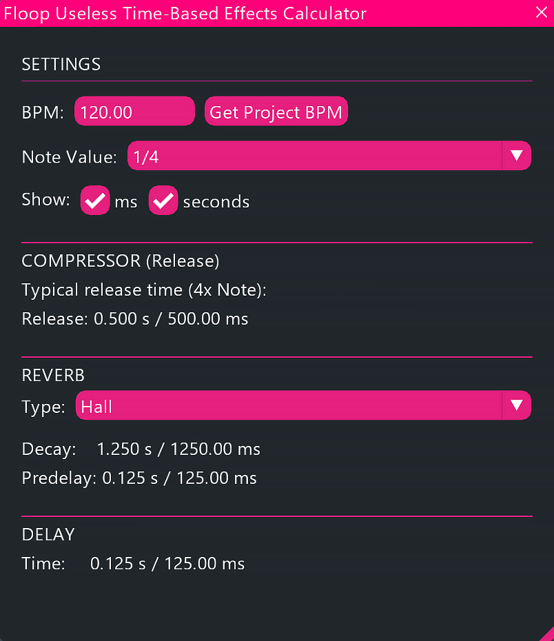

# Floop Useless Time-Based Effects Calculator

**Time-based effects calculator for REAPER.**

## Overview

**Floop Useless Time-Based Effects Calculator** is a Lua script for REAPER that helps you calculate essential time parameters for your effects based on the project BPM.
It provides instant calculations for compressor release times, reverb decay/predelay, and delay times, helping you synchronize your effects perfectly with the tempo of your track.

## Screenshot

 
    
   
    
    

## Key Features

*   **Real-Time Calculation**: Results update instantly as you change BPM, Note Value, or Reverb Type.
*   **Compressor Release**: Calculates the optimal release time (typically 4x the note duration).
*   **Reverb Parameters**:
    *   **Decay Time**: Tailored multipliers for **Hall** (2.5x), **Plate** (1.5x), and **Room** (0.8x).
    *   **Predelay**: Matches the note duration for rhythmic separation.
*   **Delay Time**: Exact milliseconds/seconds for delay plugins.
*   **Flexible Units**: Toggle display between **Milliseconds (ms)** and **Seconds (s)**.
*   **Rhythmic Variety**: Supports standard, **Dotted**, and **Triplet** notes.
*   **Project Sync**: One-click button to fetch the current project BPM.

## Requirements

*   **REAPER v6.x** or later.
*   **ReaImGui**: "ReaScript binding for Dear ImGui" installed via ReaPack. **Minimum version required: 0.10.2+**.

## Compatibility

*   **REAPER**: Developed and tested on **v7.x** (Windows).
*   **Operating Systems**:
    *   **Windows**: Fully tested and supported.
    *   **macOS / Linux**: Designed with cross-platform compatibility in mind (pure Lua + ReaImGui).

## Installation

The easiest way to install and keep the script updated is via **ReaPack**.

### Method 1: ReaPack (Recommended)

1.  **Install Prerequisites**:
    *   Open **Extensions > ReaPack > Browse Packages**.
    *   Search for and install:
        *   `ReaScript binding for Dear ImGui`
    *   **Restart REAPER**.

2.  **Add the Repository**:
    *   Open **Extensions > ReaPack > Import Repositories...**
    *   Copy and paste this URL:
        `https://github.com/floop-s/floops-reaper-scripts/raw/main/index.xml`
    *   Click **OK**.

3.  **Install the Script**:
    *   Open **Extensions > ReaPack > Browse Packages**.
    *   Search for `Floop Useless Time-Based Effects Calculator`.
    *   Right-click > **Install**.
    *   Click **Apply**.

### Method 2: Manual Installation

1.  **Install ReaImGui**:
    *   Go to **Extensions > ReaPack > Browse Packages**.
    *   Search for and install `ReaImGui`.
    *   Restart REAPER.
2.  **Install the Script**:
    *   Copy `Floop-Useless Time-Based Effects Calculator.lua` to your REAPER Scripts folder.
3.  **Load the Action**:
    *   Open Actions List (`?`).
    *   Load the script file.

## Usage

1.  **Launch** the script.
2.  **Set BPM**:
    *   Type manually or click **Get Project BPM**.
3.  **Select Note Value**:
    *   Choose from 1/1 down to 1/64, including Dotted (.) and Triplet (t) variants.
4.  **Read Results**:
    *   **Compressor**: Use the calculated Release time.
    *   **Reverb**: Select type (Hall/Plate/Room) to see Decay and Predelay.
    *   **Delay**: Use the Time value for your delay plugin.

## Troubleshooting

*   **"ReaImGui API not found"**: Install ReaImGui via ReaPack.
*   **Script doesn't open**: Ensure you have a compatible version of ReaImGui installed.

## Changelog

### v1.1 (2025-01-09)
*   Live calculation (removed Calculate buttons).
*   Added unit toggle (ms / seconds).
*   Improved UI layout and theme.

### v1.0 (2025-01-02)
*   Initial release.

## Author

Developed by **Flora Tarantino (Floop's Reaper Scripts)**  
Project home: https://www.floratarantino.com

## License

Licensed under the **GNU General Public License v3.0 (GPL-3.0)**
