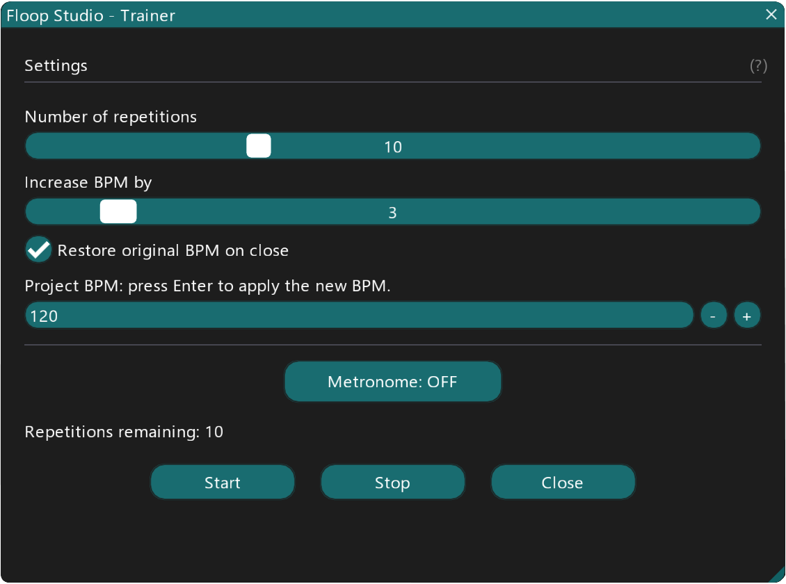

# Floop Studio Trainer

**A smart practice companion for Reaper.**

## Overview

**Floop Studio Trainer** is a Lua script for REAPER that allows you to practice your instrument inside Reaper using either an audio track or the metronome. You can set the number of repetitions for a selected section and define how many BPM to increase at a time.
Once configured, simply press start, and the script will automatically increase the project BPM after each cycle—without ever taking your hands off your instrument.
The script also displays the remaining repetitions.

## Screenshots

 
    
   
    

## Key Features

*   **Automated BPM Increase**: Automatically raises the project tempo after a set number of repetitions.
*   **Hands-Free Practice**: Focus entirely on your instrument without needing to touch the mouse or keyboard.
*   **Visual Feedback**: Real-time countdown of remaining repetitions.
*   **Metronome Control**: Toggle the metronome directly from the script interface.
*   **Safe Tempo Restoration**: Option to automatically restore the original project BPM when closing the script.
*   **Synchronization Safety**: Integrated help tooltip to ensure correct Timebase settings for audio tracks.
*   **User-Friendly GUI**: Clean interface built with ReaImGui.

## Requirements

*   **REAPER** (latest version recommended).
*   **ReaImGui**: "ReaScript binding for Dear ImGui" installed via ReaPack. **Minimum version required: 0.10.0+**.

## Compatibility

*   **REAPER**: Developed and tested on **v7.5+** (tested on recent versions; may work on older versions but not guaranteed).
*   **ReaImGui**: Version **0.10.0+** or later (older versions will crash the script).
*   **Operating Systems**: Windows, macOS, Linux (cross-platform support via Reaper's API).
*   **macOS / Linux**: Not personally tested. While the code uses cross-platform APIs, stability on these systems is not guaranteed. Feedback is welcome.
*   **Note**: The script relies on Reaper's API and ReaImGui; compatibility issues may arise with very old versions of Reaper or ReaImGui. Always update to the latest stable releases for optimal performance.

## Installation

### Method 1: Via ReaPack (Recommended)

1.  **Import the Repository**:
    *   Go to **Extensions > ReaPack > Import Repositories...**.
    *   Paste the repository URL: `YOUR_REAPACK_REPOSITORY_URL_HERE`
    *   Click **OK**.
2.  **Install the Script**:
    *   Go to **Extensions > ReaPack > Browse Packages**.
    *   Search for `Floop Studio Trainer`.
    *   Right-click the package and select **Install**.
    *   Click **Apply** and restart REAPER.
    *   *Note: ReaPack should automatically install the required `ReaImGui` dependency. If not, please install it manually via ReaPack.*

### Method 2: Manual Installation

1.  **Install ReaImGui**:
    *   Go to **Extensions > ReaPack > Browse Packages**.
    *   Search for and install `ReaImGui: ReaScript binding for Dear ImGui`.
    *   Restart REAPER.
2.  **Install the Script**:
    *   Copy the `Floop-Studio-Trainer.lua` file to your REAPER Scripts folder.
    *   Path: `REAPER > Options > Show REAPER resource path > Scripts`.
3.  **Load the Action**:
    *   Open the **Actions List** (`?`).
    *   Click **New Action > Load ReaScript...**.
    *   Select `Floop-Studio-Trainer.lua`.
    *   (Optional) Assign it to a shortcut or custom toolbar button.

## Quick Start

1.  **Select a time range** in the timeline that you want to loop.
2.  Enable **Looping** (Repeat) in the Transport controls.
3.  Run **Floop Studio Trainer** from the Actions List.
4.  Set your desired **Number of repetitions** and **BPM increment**.
5.  Press **Start**.
6.  Play along! The script will handle the tempo changes for you.

> **Important**: To prevent synchronization issues with audio items, ensure that either the **Project Timebase** or the **Track Timebase** (containing the audio) is set to **'Beats (position, length, rate)'**.

## Parameters

### Settings
*   **Number of repetitions**: Defines how many times the loop plays before the BPM increases.
*   **Increase BPM by**: Sets the amount of BPM to add after each cycle.
*   **Restore original BPM on close**: If enabled, the project tempo reverts to its initial state when you close the script.

### Controls
*   **Metronome**: Toggles the Reaper metronome on or off.
*   **Project BPM**: Manually view or edit the current project tempo (Press Enter to apply).
*   **Start / Stop**: Controls the training session.
*   **Close**: Exits the script (triggering BPM restoration if enabled).

## Troubleshooting

*   **"ReaImGui not found"**: Install via ReaPack and restart REAPER.
*   **Audio not stretching/speeding up**: Check the "Important" note above regarding Timebase settings. Your audio track must be set to 'Beats (position, length, rate)'.
*   **Loop not working**: Ensure you have created a time selection and enabled the "Repeat" button in Reaper's transport.

## Changelog

### v1.1 (2025-01-07)
*   **Restore BPM**: BPM restoration now guaranteed on force quit/crash.
*   **Logic**: Improved loop detection algorithm for short loops.
*   **Safety**: Added limits to BPM and repetition values to prevent errors.
*   **UI**: Scalable interface, refined styling, and clearer error messages.
*   **Fixes**: Better handling of manual seeks and pauses.

### v1.0 (2025-01-02)
*   Initial release.
*   Basic loop training functionality with BPM increment.

## Author

Developed by **Flora Tarantino**  
Project home: [https://www.floratarantino.com/floop-reaper-scripts/](https://www.floratarantino.com/floop-reaper-scripts/)

## License

This project is licensed under the **GNU General Public License v3.0 (GPL-3.0)**.
See the `LICENSE.txt` file in the main repository for details.
