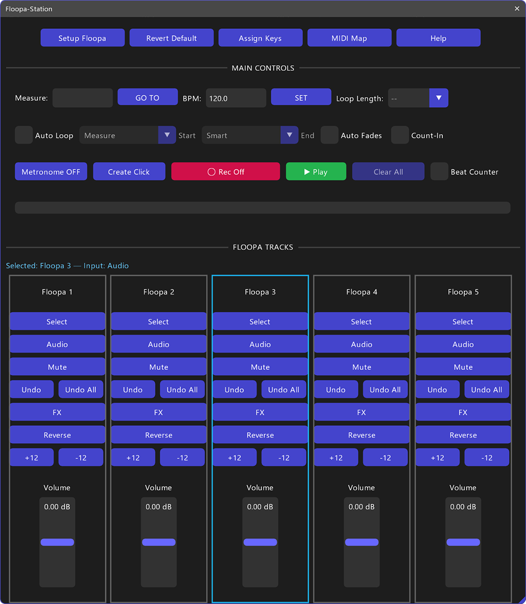

# Floopa Station - Live Looper Station

A live‑looping station for REAPER

## Overview
**Floopa Station** is a live‑looping station for REAPER featuring 5 dedicated tracks, transport controls, Auto‑Loop, Micro‑Fades, Beat Counter, Count‑In, and a loop progress bar. Designed for fast performance and editing, it provides a coherent workflow, clean mapping, and a responsive UI. 

## Screenshot

 
    
   
    
    

## Key Features

- **5 Loop Tracks**: Controls for Select, Input (Audio/MIDI), Mute, Undo, FX, Reverse, Transpose ±12 semitones.
- **Auto‑Loop**: Alignment and rounding options (Start Align, End Rounding, Epsilon Mode).
- **Micro‑Fades**: Adjustable duration and curve for loop clip in/out smoothing.
- **Count‑In**: Optional pre‑roll clicks before recording.
- **Integrated Transport**: Play/Pause/Record/Metronome/Repeat.
- **Visual Feedback**: Beat Counter, loop progress bar, and optional HUD.
- **Click Track**: Preserves selection and positions playhead coherently.
- **Key Mapping**: Essential hints with no unnecessary tooltips.

## Requirements

*   **REAPER v7.5x** or later.
*   **SWS/S&M Extension**: Required for automatic project startup refresh.
*   **ReaImGui**: "ReaScript binding for Dear ImGui" installed via ReaPack. **Minimum version required: 0.10.2+**.

## Compatibility
*   **REAPER**: Developed and tested on **v7.5x+** (Windows).
*   **Operating Systems**:
    *   **Windows**: Fully tested and supported.
    *   **macOS / Linux**: Designed with cross-platform compatibility in mind (using system-agnostic path handling), but not personally tested on these systems. Feedback is welcome!

## Installation
The easiest way to install and keep the script updated is via **ReaPack**.

### Method 1: ReaPack (Recommended)

1.  **Install SWS/S&M Extension**:
    - Download from [sws-extension.org](https://www.sws-extension.org/) and run the installer or install via ReaPack.
    - Restart REAPER.

2.  **Install ReaImGui**:
    - Extensions > ReaPack > Browse Packages
    - Search for "Dear ImGui for ReaScript" and install.
    - Restart REAPER.

3.  **Install Floopa Station**:
    - Add my repository to ReaPack (see Project home) or download the script manually.
    - If manual: extract the entire `Floopa Station` folder (including all modules and subfolders) into REAPER's **Scripts**   directory inside the REAPER **Resource Path**  (Options → Show REAPER resource path in explorer/finder).

4.  **Load the Script**:
    - Open Action List (`?`).
    - Search for "Floopa Station".
    - Run the script.

## Quick Start

1.  Click **Setup Floopa** to auto‑configure (clears Time Selection/loop points, enables Repeat).
2.  Use track buttons to arm/record, mute, apply FX, or transpose.
3.  **Auto‑Loop** manages alignment automatically. Use "Loop Length" to set measures.
4.  Toggle **Auto Fades** if you want automatic smoothing.
5.  Use **Count‑In** for pre‑roll clicks before recording.
6.  Use the **Beat Counter** and progress bar as visual references.

## Usage Notes

79→- **Auto‑Loop**: Uses your first recording pass to set loop length and alignment at any position on the timeline and handles Repeat automatically when using "Setup Floopa".
80→- **Auto‑Loop behavior**: Works from any position on the timeline; recording no longer needs to start at bar 1.
- **Micro‑Fades**: Smooth clip edges; toggle via "Auto Fades".
- **Count‑In**: Plays pre‑roll clicks before recording only (metronome ON for pre‑roll, OFF during recording). Defaults to 2 measures (adjustable in REAPER settings).

## Parameters & Configuration

### Micro‑Fades Details
- **Scope**: Project‑scoped (stored via ExtState).
- **Duration**: 0–500 ms.
- **Shape**: Linear, Exponential, Logarithmic.

### Advanced — ExtState Keys (`Floopa` Namespace)
*For advanced users customizing behavior via ExtState.*

- `loop_auto_enabled` ("1"|"0")
- `loop_quantize` ("measure"|"beat")
- `loop_start_align` ("measure"|"exact")
- `loop_epsilon_mode` ("dynamic"|"strict")
- `loop_microfades_enabled` / `_ms` / `_shape`
- `hud_enable` ("1"|"0")
- `count_in_mode` ("1"|"0")

## Troubleshooting

- **"ReaImGui not found"**: Install via ReaPack and restart REAPER.
- **Click Track issues**: Verify Time Selection and Repeat; the function preserves selection.
- **HUD**: Toggle with `hud_enable` if you prefer a minimal interface.
- **Buttons not responding**: Ensure REAPER main window has focus.

## Developer Notes

- **Internal Tests**: The `Tests` folder contains internal tests used during development. These are not required for the script to function and are not included in the standard distribution.

## Changelog

### v1.1.1 (2026-01-18)
- Auto-Loop length and recording position fixed (timeline-agnostic behavior).

### v1.1.0 (2026-01-08)
- **Stability & Logic**:
  - Rewrote `ensureFloopaTracksIdempotent` to guarantee 5 tracks without duplication or errors.
  - Improved `alignLoopToNearestItemBoundaries` with independent start/end thresholds for precise loop alignment.
  - Hardened `setupFloopa`/`revertFloopa` to correctly save/restore all user settings (including 43151, 41818, 41819).
  - Updated MIDI Control track management to use GUIDs, preventing accidental deletion of user tracks with similar names.
- **UI & Usability**:
  - Enabled Docking support (removed NoDocking flag).
  

### v1.0.0 (2025-03-08)
- Initial release.
- Added Count‑In checkbox and metronome snapshot restoration.
- Improved consistency of progress bar and HUD.
- Added "Auto‑Loop" and "Micro‑Fades" help sections.

## Author

Developed by **Flora Tarantino**  
Project home: [https://www.floratarantino.com/floop-reaper-scripts/](https://www.floratarantino.com/floop-reaper-scripts/)

## License

Licensed under the **GNU General Public License v3.0 (GPL-3.0)**  
See the `LICENSE.txt` file in the main repository for details.
